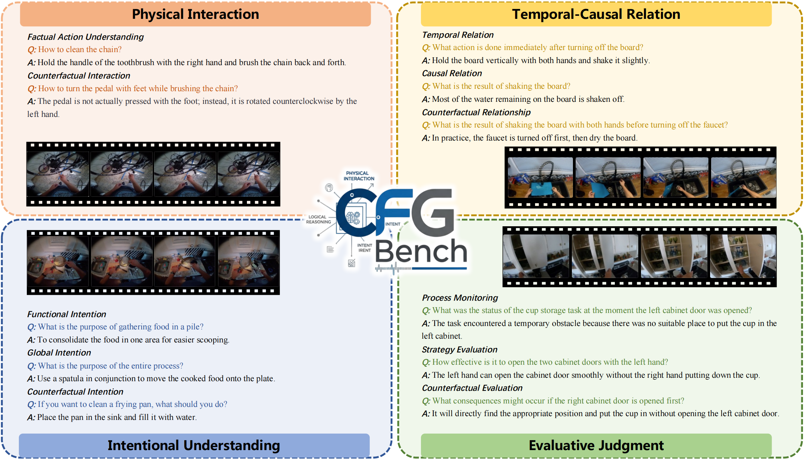
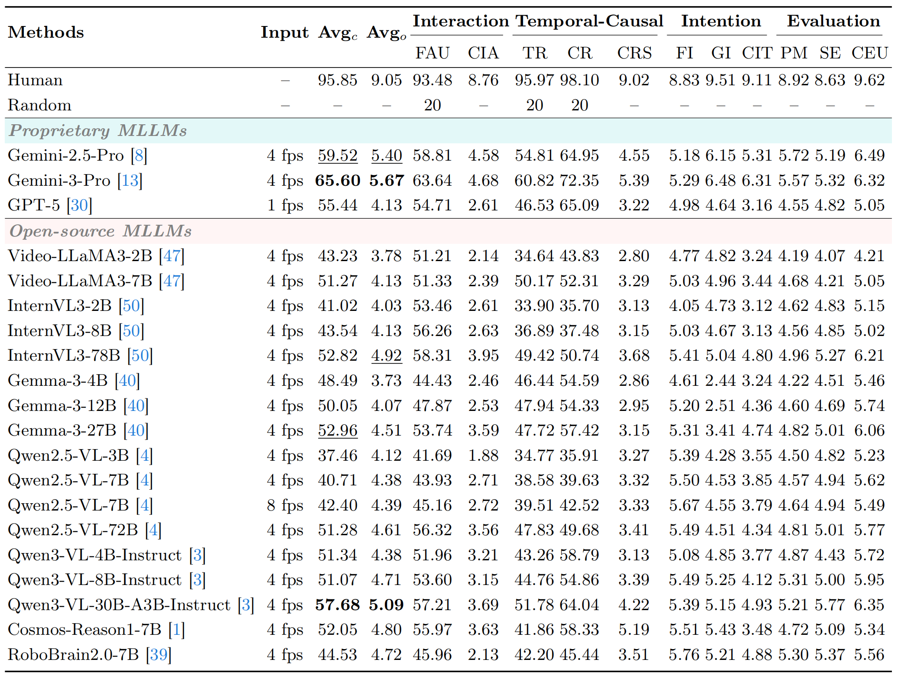
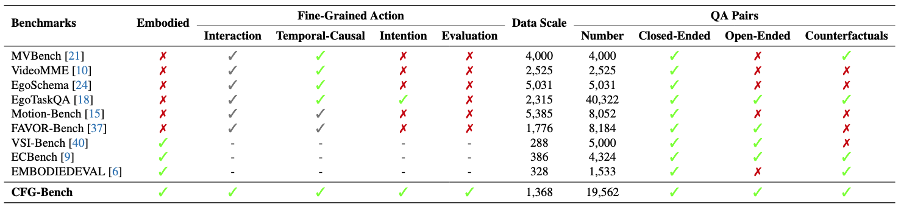
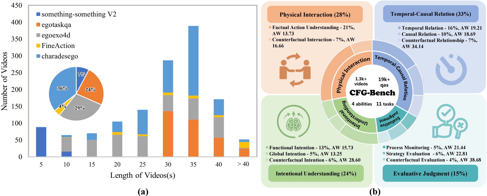

# CFG-Bench

<div align="center">

<h2>Beyond Description: Cognitively Benchmarking Fine-Grained Action for Embodied Agents</h2>

[](https://www.arxiv.org/abs/2511.18685)
[](https://huggingface.co/datasets/CFG-Bench/CFG-Bench) 
[](https://cfg-bench.github.io/)

</div>

---

## News

* **`2026.06`** 🎉 CFG-Bench has been accepted to ECCV 2026!
* **`2026.06`** 🌟 We released CFG-Bench, a fine-grained cognitive benchmark for embodied agents.

## Introduction

Multimodal Large Language Models (MLLMs) show promising results as decision-making engines for embodied agents operating in complex, physical environments. However, existing benchmarks often prioritize high-level planning or spatial reasoning, leaving the fine-grained action intelligence required for embodied physical interaction underexplored. To address this gap, we introduce CFG-Bench, a new benchmark designed to systematically evaluate this crucial capability. CFG-Bench consists of 1,368 curated videos paired with 19,562 three-modalities question-answer pairs targeting four cognitive abilities: 1) Physical Interaction, 2) Temporal-Causal Relation, 3) Intentional Understanding, and 4) Evaluative Judgment. Together, these dimensions provide a systematic framework for assessing a model's ability to translate visual observations into actionable knowledge, moving beyond mere surface-level recognition. Our comprehensive evaluation on CFG-Bench reveals that leading MLLMs struggle to produce detailed instructions for physical interactions and exhibit profound limitations in the higher-order reasoning of intention and evaluation. Moreover, supervised fine-tuning (SFT) on our data demonstrates that teaching an MLLMs to articulate fine-grained actions directly translates to significant performance gains on established embodied benchmarks. Our analysis highlights these limitations and offers insights for developing more capable and grounded embodied agents.

## Task Demonstration

<p align="center">
    
</p>

## Evaluate

### License

Our dataset is under the CC-BY-NC-SA-4.0 license.

If you need to access and use our dataset, you must understand and agree: **This dataset is for research purposes only and cannot be used for any commercial or other purposes. The user assumes all effects arising from any other use and dissemination.**

We do not own the copyright of any raw video files. Currently, we provide video access to researchers under the condition of acknowledging the above license. For the video data used, we respect and acknowledge any copyrights of the video authors. Therefore, we have applied several preprocessing steps to minimize any potential impact on the original copyrights. These include reducing video resolution, segmenting videos into short clips, and applying dimension adjustments.

If any content in CFG-Bench raises copyright concerns, please contact liu_dayong@zju.edu.cn or open an issue in this repository. We will review the request promptly and, when needed, replace the relevant video clips with adjusted sparse-frame representations. If frame-level release is also unsuitable, we will keep the annotations while replacing the visual content with metadata or other appropriate alternatives.

### Datasets
1. Download the CFG-Bench videos and put all the mp4 files in one directory, for example `./videos`.
2. Put `qa_pairs.json` and `caption.json` in the project root:
```text
CFG-Bench/
|-- qa_pairs.json
|-- caption.json
`-- videos/
    |-- video_1.mp4
    `-- ...
```

### Proprietary MLLMs
We give the example of evaluating Gemini-2.5-Pro on CFG-Bench as follows:

1. Install the required dependencies and apply for the API following [Google AI Studio](https://ai.google.dev/gemini-api/docs/generate-content/get-started).
2. Run the inference code:
```bash
python evaluate/proprietary_mllms/eval_gemini.py
```

### Open-source MLLMs
We give examples of evaluating Qwen3-VL-8B-Instruct on CFG-Bench as follows:

#### Local deployment
1. Install the required dependencies and download checkpoints following the [Qwen3-VL official repo](https://github.com/QwenLM/Qwen3-VL).
2. Run the local inference code:
```bash
python evaluate/open_source_mllms/eval_qwen_local.py
```

#### DashScope API
1. Apply for a DashScope API key from [Alibaba Cloud Model Studio](https://bailian.console.aliyun.com/).
2. Run the DashScope inference code:
```bash
python evaluate/open_source_mllms/eval_qwen_dashscope.py
```

Then the results will be written to a json file in `./outputs/evaluate/`.

### Judge
We give the example of judging model responses with DeepSeek-R1 as follows:

1. Install the required dependencies from [Alibaba Cloud Model Studio](https://bailian.console.aliyun.com/) or another OpenAI-compatible DeepSeek-R1 service, and apply for the API.
2. Run the judge code:
```bash
python judge/judge_deepseek_r1.py --save-summary
```

Then the judged results will be written to `./outputs/judge/`, and the summary file will be written to `./outputs/summary/`.

## Results

- **Model Comparison:**

<p align="center">
    
</p>

- **Benchmark Comparison:**

<p align="center">
    
</p>


- **Benchmark Statistics:**

<p align="center">
    
</p>
Data statistics of CFG-Bench. (a) Distribution and video length statistics of the five datasets. (b) The distribution of tasks across four tiers. AW means average words of questions.

## Citation

If you find our work helpful for your research, please consider citing our work.

```bibtex
@article{liu2025beyond,
  title={Beyond Description: Cognitively Benchmarking Fine-Grained Action for Embodied Agents},
  author={Liu, Dayong and Xu, Chao and Chen, Weihong and Zhang, Suyu and Wang, Juncheng and Deng, Jiankang and Sun, Baigui and Liu, Yang},
  journal={arXiv preprint arXiv:2511.18685},
  year={2025}
}
```
